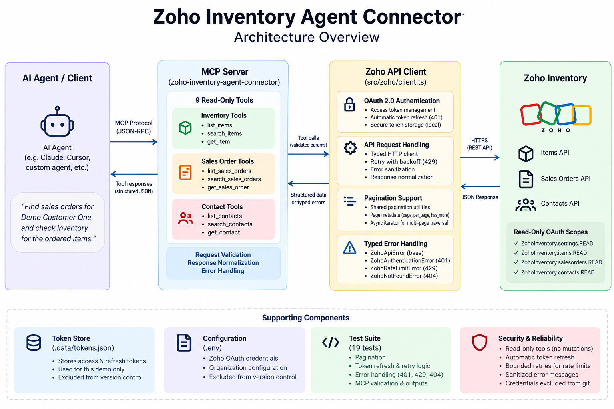

# Architecture

## Overview

Zoho Inventory Agent Connector is a read-only MCP server that exposes merchant inventory, sales orders, and contacts to an AI agent. An Express application handles the local OAuth callback and an MCP stdio process serves the tools.



## Request Flow

```text
Agent
  -> MCP tool
  -> Zoho API client
  -> OAuth token manager
  -> Zoho Inventory API
```

The Express OAuth flow stores access and refresh tokens in `.data/tokens.json`. The MCP process reads that shared local token store and attaches the access token and configured `organization_id` to Zoho API requests.

## Components

### MCP Server

`src/mcp/server.ts` creates an `McpServer`, registers the nine read-only tools, and serves MCP over stdio. Tool inputs are validated with Zod, and handlers return focused structured content.

### Zoho API Client

`src/zoho/client.ts` centralizes Inventory API URL construction, organization scoping, OAuth token use, refresh-on-expiry/401, bounded 429 retries, and typed error mapping. Error messages avoid returning upstream response bodies.

### OAuth

`src/auth/oauth.ts` implements Zoho's OAuth 2.0 authorization-code flow with offline access and refresh tokens. `src/auth/tokenStore.ts` persists the token set locally. OAuth state is validated and held in process memory.

### Pagination

`src/zoho/pagination.ts` provides an async iterator for consumers that explicitly need multiple pages, plus shared pagination metadata formatting. MCP list and search tools return one requested page and expose `has_more`; they do not automatically aggregate the full dataset.

## Security

- OAuth requests only read scopes for settings, items, sales orders, and contacts.
- No create, update, delete, send, or approve tools are registered.
- OAuth callback state is validated and consumed once.
- `.env` is excluded from source control.
- Zoho API errors are normalized without embedding provider response bodies in messages.
- Token data is stored outside Git in `.data/tokens.json`; this local store is plaintext and is not production-grade.
